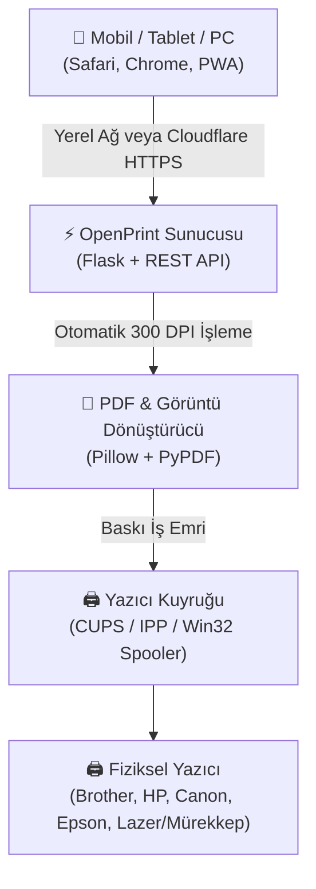

# 🖨️ Kolay Yazıcı / OpenPrint

> **Sürücüsüz, Zahmetsiz ve Kişisel Bulut Yazdırma Sunucusu (Self-Hosted Driverless Cloud Printing)**  
> Evinizdeki veya ofisinizdeki tüm yazıcıları (Brother, HP, Canon, Epson vb.) **tek tıkla** telefonunuzdan, tabletinizden veya laptopunuzdan çıktı alınabilir hale getirin. Sürücü kurmaya, karmaşık ağ ayarlarına veya kablo takmaya son!

[](LICENSE)
[](https://python.org)
[](#)
[](#)
[](#)

---

## 📸 Ekran Görüntüsü & Özellikler


### ✨ Neden OpenPrint?

- 🚀 **1-Tıkla Kurulum (`.sh` & `.bat`):** Windows'ta `install.bat`'a çift tıklayın veya Linux/macOS'ta `bash install.sh` çalıştırın; her şey otomatik kurulur ve tarayıcınız açılır.
- 📱 **Sürücüsüz & PWA:** iPhone, iPad, Android, Mac veya Windows; hiçbir ek sürücü yüklemeden web arayüzünden doğrudan yazdırın. Safari/Chrome üzerinden tek dokunuşla ana ekrana uygulama olarak eklenebilir.
- 📷 **Kamera ile Belge Tarama:** Ödev, fatura, kimlik veya belgelerinizin fotoğrafını çekin; otomatik kırpma ve yüksek çözünürlüklü (300 DPI) PDF dönüştürme motoru sayesinde pürüzsüz baskı alın.
- 🎨 **Kapsamlı Baskı Seçenekleri:**
  - Canlı **Renkli** veya tasarruflu **Siyah-Beyaz** modu
  - Düz Kağıt (A4), Parlak Fotoğraf Kağıdı veya Kuşe Kağıt seçimi
  - **Dikey / Yatay** otomatik sayfa yönlendirme
  - Kopya sayısı sayacı (`+` / `-`) ve sayfa aralığı belirleme (örn: `1-3, 5`)
  - Standart, Yüksek Çözünürlük ve Taslak kalite ayarları
- 🏷️ **Yazıcı QR Kodu:** Yazıcınızın üzerine yapıştırmak için tek tıkla QR kod üretin. Misafirleriniz veya aileniz sadece QR kodu okutarak anında çıktı alabilir.
- ☁️ **İnternetten Erişim (Cloudflare Tunnel):** Statik IP veya modemden port açma derdi olmadan, ev dışındayken bile yazıcınıza uzaktan güvenle belge gönderin.
- 🛡️ **KVKK & Gizlilik:** Yazdırılan geçici dosyalar işlem bitiminde sunucudan otomatik olarak temizlenir; verileriniz tamamen yerel ağınızda güvende kalır.

---

## ⚡ Hızlı Kurulum (Quick Start)

### 🪟 Windows (Tek Tıkla Başlat)

1. Projeyi indirin veya zip olarak açın:
   ```cmd
   git clone https://github.com/username/openprint.git
   cd openprint
   ```
2. **`install.bat`** veya **`baslat.bat`** dosyasına **çift tıklayın**.
3. Python ve paketler otomatik kurulacak, varsayılan yazıcınız algılanacak ve tarayıcınızda `http://localhost:5050` açılacaktır.

---

### 🐧 Linux & Raspberry Pi & macOS

Projeyi klonlayıp kurulum betiğini çalıştırın:

```bash
git clone https://github.com/username/openprint.git
cd openprint
bash install.sh
```

Arka planda daimi `systemd` servisi olarak çalıştırmak için:
```bash
sudo bash install.sh --service
```

---

### 🐳 Docker ile Kurulum

```bash
docker compose up -d
```
Sunucu `http://localhost:5050` adresinde çalışacaktır.

---

## 🌐 Ev Dışından Güvenli Erişim (Cloudflare Tunnel)

Ev dışındayken telefonunuzdan çıktı alabilmek için ücretsiz Cloudflare Quick Tunnel kullanabilirsiniz:

```bash
# Cloudflared tünel başlatın:
cloudflared tunnel --url http://127.0.0.1:5050
```

Ekranda size özel üretilen `https://xyz.trycloudflare.com` bağlantısı çıkacaktır. Bu linki telefonunuzdan açarak dünyanın her yerinden evdeki yazıcınıza güvenle çıktı gönderebilirsiniz!

---

## 🏗️ Sistem Mimarisi



---

## 📁 Proje Yapısı

```
openprint/
├── backend/
│   ├── app.py                 # REST API ve Webhook Sunucusu
│   ├── converters.py          # PDF / Fotoğraf Dönüştürücü ve Optimizasyon
│   └── engine/
│       ├── discovery.py       # Ağdaki Yazıcıları Otomatik Bulucu
│       ├── printer_linux.py   # CUPS / Linux / macOS Yazdırma Motoru
│       └── printer_windows.py # Windows Win32 Spooler Motoru
├── frontend/
│   ├── templates/
│   │   └── index.html         # Modern Kolay Yazıcı Web & PWA Arayüzü
│   └── static/
│       ├── manifest.json      # PWA Manifest (Uygulama olarak yükleme)
│       └── sw.js              # Çevrimdışı & Servis Çalışanı
├── scripts/
│   ├── install.sh             # Linux/macOS Kurulum Betiği
│   └── install_windows.bat    # Windows Kurulum ve Başlatıcı
├── install.sh                 # Kök Dizin Linux Kurulum Kısayolu
├── install.bat                # Kök Dizin Windows Kurulum Kısayolu
├── run.sh                     # Linux Başlatıcı
├── run.bat                    # Windows Başlatıcı
├── docker-compose.yml         # Docker Dağıtım Dosyası
├── Dockerfile                 # Docker İmaj Tanımı
├── requirements.txt           # Python Bağımlılıkları
└── README.md                  # Proje Tanıtım ve Rehberi
```

---

## 📜 Lisans

Bu proje [MIT Lisansı](LICENSE) kapsamında açık kaynak olarak sunulmaktadır.
